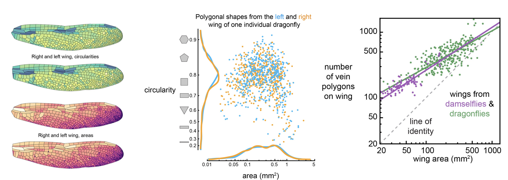
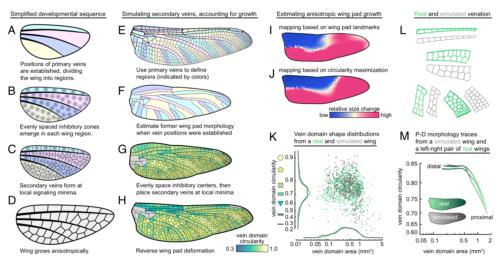
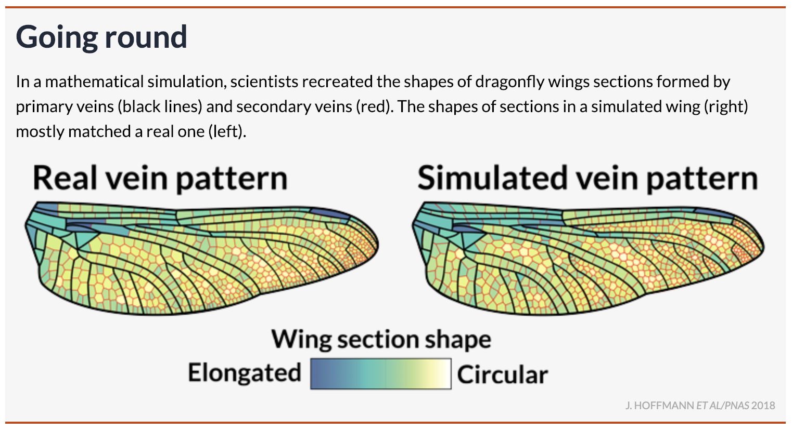
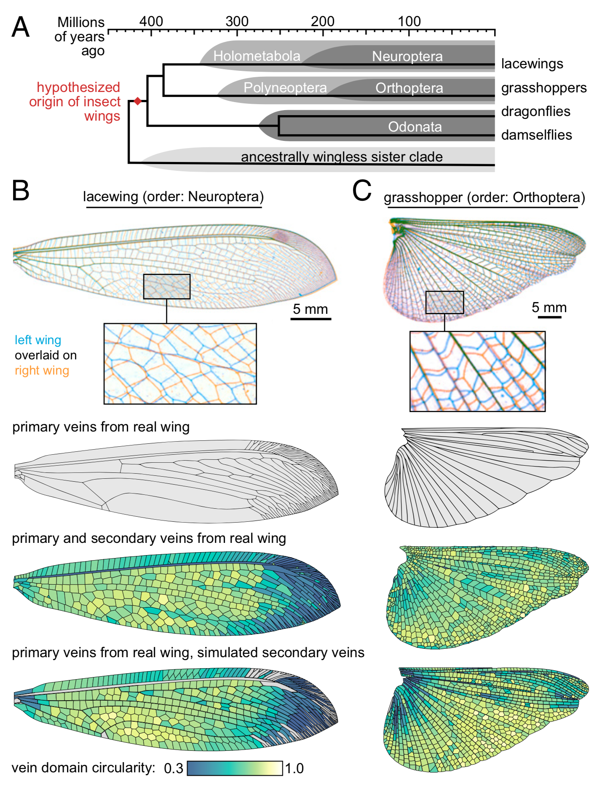

A simple developmental model recapitulates complex
insect wing venation patterns

Jordan Hoffmann,
Seth Donoughe,
Kathy Li,
Mary K. Salcedo,
Chris H Rycroft

***************************************************************
Wing Segmentation and Circularity Optimization Code
Code Written By Jordan Hoffmann, Seth Donoughe, Kathy Li
===============================================================


Contents
===============================================================
All code used in the manuscript is available upon request. Here we provide
basic code that segments and runs out routine on an example wing.

Segment Wing Image 
	-Code and example wing used to segment wings in the manuscript.
Optimization
	-Code used to perform area-weighted circularity optimization


Wing Segmentation Citations
===============================================================
Garrison, R. W., Ellenrieder, von, N. and Louton, J. A. (2006). Dragonfly genera of the New World : an illustrated and annotated key to the Anisoptera. Baltimore, MD: JHU Press.

Garrison, R. W., Ellenrieder, von, N. and Louton, J. A. (2010). Damselfly genera of the New World : an illustrated and annotated key to the Zygoptera. Baltimore, MD: JHU Press.

Needham, J. G., Westfall, M. J. and May, M. L. (2014). Dragonflies of North America : the Odonata (Anisoptera) fauna of Canada, the continental United States, northern Mexico and the Greater Antilles. Third edition. Gainesville, FL: Scientific Publishers.

Westfall, M. J. and May, M. L. (1996). Damselflies of North America. Scientific Publishers Gainesville.

Code Requirements
===============================================================
	All Python Code Python v 2.7
	Anaconda makes installing all packages easy.
	All Mathematica code works in Mathematica 10 and 11
	Dependencies:
		numy, scipy, Pillow, matplotlib
		scikit-fmm [https://github.com/scikit-fmm/scikit-fmm]
		scikit-image [http://scikit-image.org/]
	Installation of dependencies on clean Ubuntu build
		pip install numpy
		pip install scipy
		pip install Pillow
		pip install matplotlib
		pip install scikit-fmm
		pip install scikit-image
	Code can be easily parallelized to run on many wing images simultaneously using
		mpi4py
		glob


Video of Optimization Routine
===============================================================
See: https://www.youtube.com/watch?v=VNW66Iuc-VI

Running the code
===============================================================
Once dependencies installed:
```bash
cd Segment_Wing_Image
python generate_seeds_and_velocity.py
python segment.py
python mask_image.py
cd ..
```
Open Mathematica Notebook for Polygonization and Optimization routines.

Manuscript Information
===============================================================
Here is a great twitter thread from Seth Donoughe: https://twitter.com/seth_donoughe/status/1041802508585394177
Below, I reproduce some of the highlights.

Dragonfly wings show a large selection of interesting geometric shapes. Simple models, like Voronoi cells, do not accurately capture observed shapes.
We amassed a dataset of ~500 dragonfly and damselfly wings and performed a thorough analysis and segmentation of the geometric patterns. Code and data provided. 

From this data, we hypothesized a developmental model where repulsive centers equilibrate on a developing wing. 

Below, I show a real wing and a wing generated by our model. This is an image we provided for a [ScienceNews](https://www.sciencenews.org/article/how-math-helps-explain-delicate-patterns-dragonfly-wings) article.

We find that this model is able to capture some motifs from other insects as well!


Here is an article from the Harvard SEAS news office: https://www.seas.harvard.edu/content/lord-of-wings
